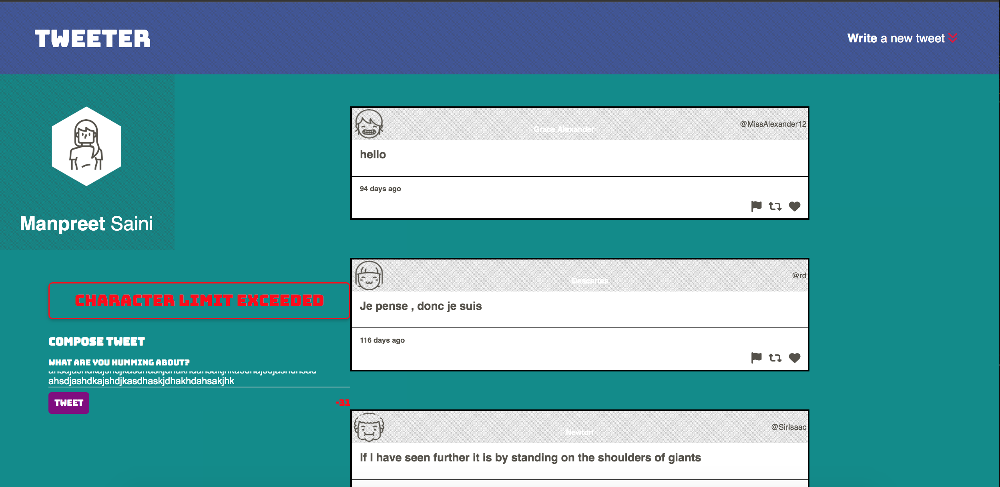
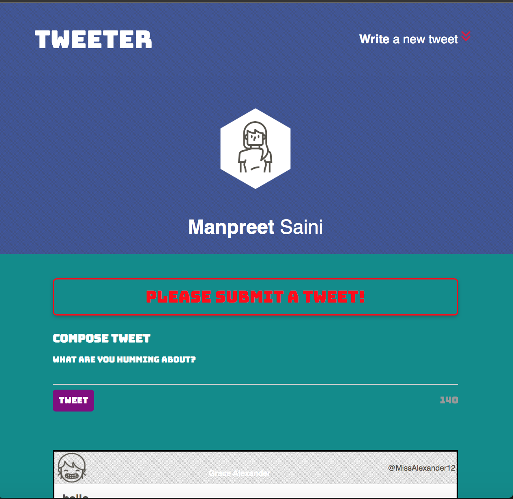
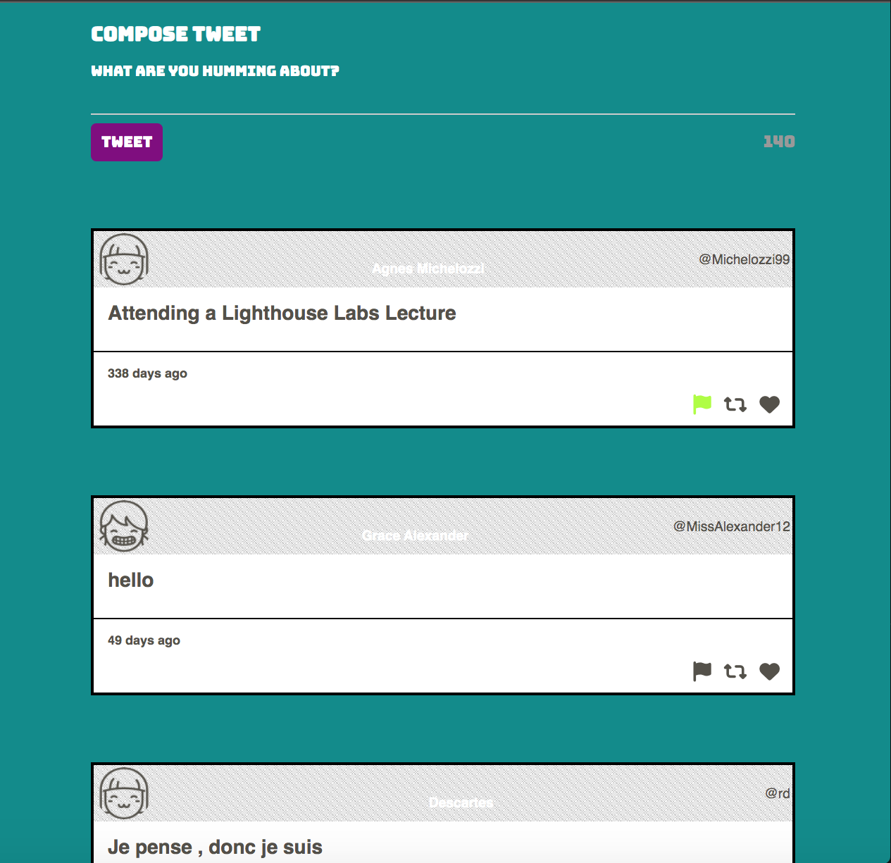
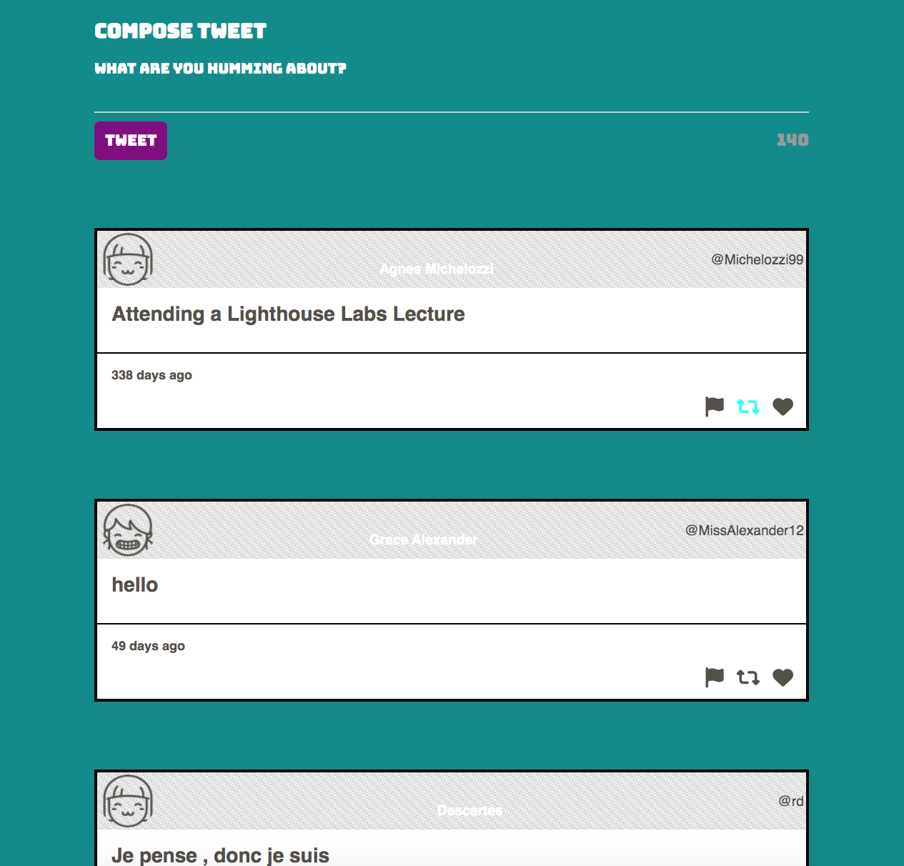
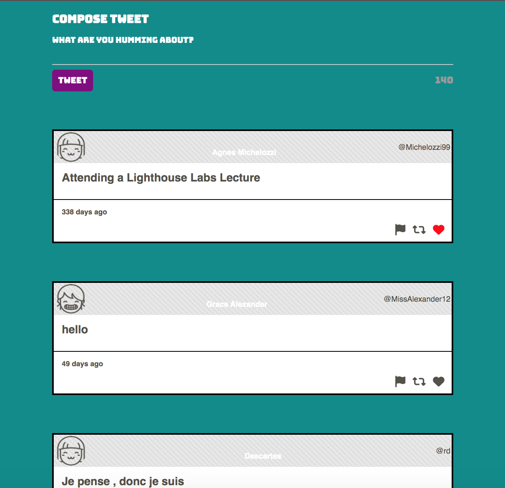

# Tweeter Project

Tweeter is a simple, single-page Twitter clone.

This repository is the starter code for the project: Students will fork and clone this repository, then build upon it to practice their HTML, CSS, JS, jQuery and AJAX front-end skills, and their Node, Express back-end skills.

## Getting Started

1. [Create](https://docs.github.com/en/repositories/creating-and-managing-repositories/creating-a-repository-from-a-template) a new repository using this repository as a template.
2. Clone your repository onto your local device.
3. Install dependencies using the `npm install` command.
3. Start the web server using the `npm run local` command. The app will be served at <http://localhost:8080/>.
4. Go to <http://localhost:8080/> in your browser.

## Dependencies

The Tweeter project has the following dependencies:

- Express
- Node 5.10.x or above
- Body-Parser
- Chance
- MD5

Please make sure you have these dependencies installed before running the project.

## Features

The Tweeter project includes the following features:

- Compose and submit tweets with a character limit of 140.
- Display tweets in a timeline format, showing the most recent tweets at the top.
- Display the time elapsed since each tweet was posted.
- Responsive design for optimal viewing on different devices.

## Screenshots

Error Message in Desktop Mode:

Error Message in Tablet Mode:

Hover over Flag:

Hover over Retweet:

Hover over Like:

## Authors

`Lighthouse Labs` - [Lighthouse Lab's GitHub Profile](https://github.com/lighthouse-labs/)

`Manpreet Saini` - [Manpreet's GitHub Profile](https://github.com/Mpsingh4/)

## License

This project is licensed under the MIT License - see the [LICENSE](https://opensource.org/license/mit/) file for details.